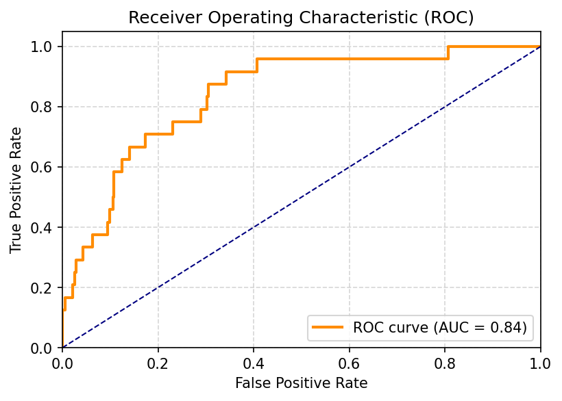

# Credit Risk Modeling & Scorecard Development System

This project demonstrates a complete end‑to‑end workflow for building a
credit risk prediction model and converting it into a points‑based credit
scorecard suitable for deployment in financial services.  The repository is
structured for clarity and reproducibility: data lives in the `data/`
directory, Python modules reside in `src/`, reports and generated artefacts
are stored in `reports/`, and this README guides users through the process.

## Overview

Credit scoring is a statistical method used to estimate the probability that a
loan applicant, existing borrower or counterparty will default on their
obligations.  A credit scorecard groups characteristics (e.g., age, income,
employment status) that have been shown to be predictive of default into
bins and assigns points based on their relative risk.  An individual’s
credit score is the sum of these points【612871274472988†L946-L959】.

Traditional credit scoring models rely on interpretable techniques such as
logistic regression because they are relatively easy to develop, validate and
calibrate【612871274472988†L1593-L1618】.  Logistic models translate features into a
linear combination of log‑odds; when paired with **weight of evidence (WoE)**
transformations, the resulting coefficients align naturally with the log‑odds
framework.  WoE is a transformation that bins continuous variables and
represents each bin as the natural logarithm of the ratio between the
proportion of good customers (non‑defaulters) and bad customers (defaulters)
in that bin.  Fine classing, coarse classing and WoE transformations help
convert non‑linear relationships into linear ones and allow analysts to
compare variable effects directly【502788119636434†L328-L385】.

Logit (logistic regression) models remain a workhorse for default prediction in
industry because they provide a good balance between predictive power and
interpretability【932866755921864†L14-L72】.  Each coefficient can be interpreted as an
odds ratio, allowing risk managers to understand how changes in independent
variables affect the probability of default.

## Dataset

For demonstration purposes this project uses a synthetic dataset generated to
reflect common credit risk characteristics.  Each row represents an
applicant/loan with the following features:

- **age** (years)
- **income** (simulated annual income in arbitrary currency)
- **loan_amount** (requested loan amount)
- **loan_term_months** (duration of the loan in months)
- **credit_history_length** (length of credit history in years)
- **number_of_dependents** (number of dependents supported by the applicant)
- **employment_status** (categorical: `salaried`, `self‑employed`, `unemployed`, `retired`)
- **property_owned** (categorical: `own`, `rent`, `mortgage`)
- **default** (target: `1` = default, `0` = non‑default)

The data generator introduces correlations between the features and default
probability to approximate real‑world behaviour (e.g., higher income and
longer credit history reduce default risk, while larger loan amounts and
more dependents increase risk).  The synthetic nature of the dataset makes
this repository suitable for educational use and avoids sharing any
confidential information.

## Project Structure

```
credit_risk_scorecard/
├── data/
│   └── credit_risk_data.csv      # synthetic dataset used for modelling
├── src/
│   ├── credit_scorecard.py       # core functions for WoE, modelling and scorecard
│   └── run_scorecard.py          # command‑line script orchestrating the workflow
├── reports/
│   ├── roc_curve.png             # ROC curve for the test set
│   └── scores.csv               # per‑record scores generated by the script
├── requirements.txt             # Python dependencies
└── README.md                    # project documentation
```

### Key Modules

- `credit_scorecard.py` implements reusable functions:
  - `compute_woe_iv` bins variables and computes WoE and Information Value (IV), a
    measure of predictive strength.  The WoE transformation standardises
    variables so their coefficients are comparable【502788119636434†L372-L379】.
  - `prepare_woe_dataframe` applies WoE transformations to selected
    continuous and categorical features and returns the transformed data and
    mappings.
  - `train_logistic_regression` fits a scikit‑learn `LogisticRegression` model.
  - `evaluate_model` reports accuracy and AUC metrics.
  - `build_scorecard` converts the fitted model into a points‑based credit
    scorecard using user‑defined base score, odds and points to double the
    odds【502788119636434†L417-L431】.

- `run_scorecard.py` orchestrates the full modelling flow: it loads data,
  applies transformations, splits the dataset, trains the model, evaluates
  performance, builds the scorecard and writes out individual scores.

### Reports

The `reports/` directory contains artefacts generated by running
`run_scorecard.py`.  `roc_curve.png` shows the Receiver Operating
Characteristic (ROC) on the test set, illustrating the trade‑off between
true‑positive and false‑positive rates.  `scores.csv` contains the final
credit scores for each observation, which can be used to rank applicants.



## How to Run

1. **Set up a Python environment.**  Use Python 3.8 or later.  Install
   dependencies from the `requirements.txt` file:

   ```bash
   pip install -r requirements.txt
   ```

2. **Execute the modelling script:**

   ```bash
   cd credit_risk_scorecard
   python -m src.run_scorecard
   ```

   The script prints information values, model performance on the train and test
   splits, a sample of the generated scorecard and writes a CSV file with
   individual scores to the `reports/` directory.  You can adjust the
   hyperparameters (e.g., number of bins, base odds) by editing
   `run_scorecard.py` or calling the underlying functions directly in your
   own scripts or notebooks.

3. **Inspect the scorecard.**  After running the script, the console output
   includes a sample of the scorecard mapping for the first few features.
   Each entry shows how many points are assigned to a specific bin or
   category.  For example, borrowers with a long credit history and lower
   WoE (indicating lower risk) receive more points than those with short
   histories.

## Understanding the Scorecard

Scorecards translate model outputs into a practical scoring scheme.  The
`build_scorecard` function uses three parameters:

- **Base Score** (e.g., 600) – the score assigned when the odds of non‑default
  equal the specified base odds.
- **Base Odds** (e.g., 50:1) – the ratio of good to bad loans at the base
  score; higher odds correspond to lower risk.
- **Points to Double the Odds** (e.g., 20) – the number of points that
  increase (or decrease) the odds of non‑default by a factor of two.  A
  typical choice is 20 or 50 points.  These parameters control the
  distribution and interpretability of the resulting scores【502788119636434†L425-L431】.

The formula used to convert logistic regression parameters into scorecard
points is:

```text
score = Offset + Factor × (Intercept + Σ βᵢ × WoEᵢ)
```

where `Factor = (points_to_double_odds) / ln(2)` and
`Offset = base_score − Factor × ln(base_odds)`.  Each variable contributes
`points = −βᵢ × WoEᵢ × Factor` so that higher WoE (lower risk) leads to higher
points.

## References

* **Credit Scorecard Concept:** The World Bank’s guidelines explain that a credit
  scorecard is a set of characteristics with points assigned based on
  statistical analyses; an individual’s credit score is the sum of these
  characteristic scores【612871274472988†L946-L959】.
* **Logistic Regression for Default Prediction:** The World Bank guidelines
  highlight that logistic (logit) models are popular for estimating the
  probability of default because they are easy to develop, validate and
  interpret【612871274472988†L1593-L1618】.  Learnsignal’s industry
  commentary notes that logit models are widely used in default prediction
  due to their predictive power and interpretability【932866755921864†L14-L72】.
* **Variable Transformations:** Altair’s credit scorecard development guide
  emphasises the importance of fine classing, coarse classing and weight of
  evidence transformations to create linear relationships between variables
  and default risk【502788119636434†L328-L385】.  The same source explains
  that scaling converts model outputs into a desired score range by specifying
  base points, base odds and points to double the odds【502788119636434†L417-L431】.

By following this project you will understand how these concepts fit together
and be able to adapt the pipeline to your own data.  The modular design
allows you to extend the models (e.g., by adding new features or trying
different algorithms) while maintaining transparency and traceability.